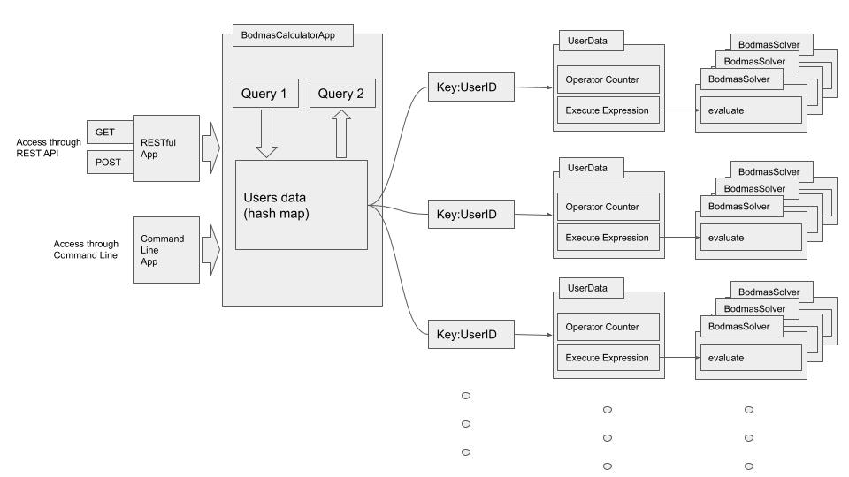
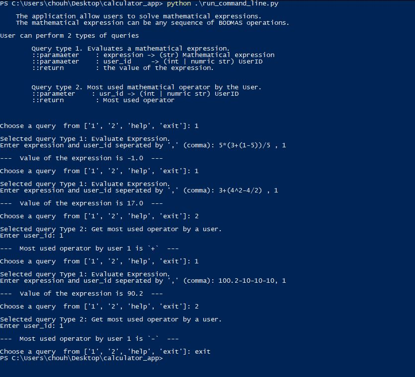
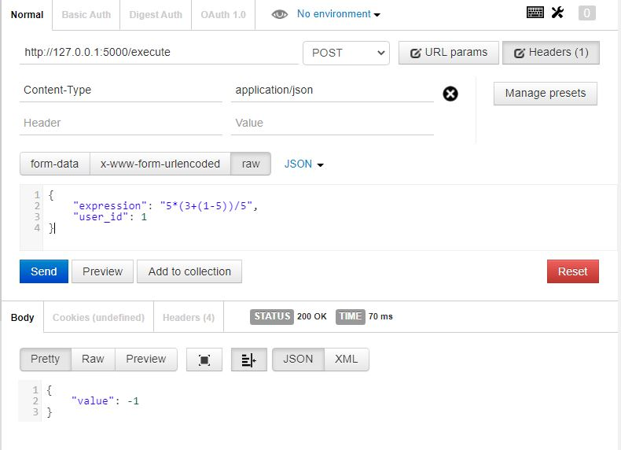
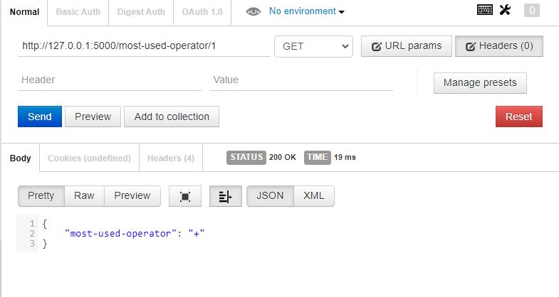

# BODMAS Calculator

#### The application allow users to solve mathematical expressions. The mathematical expression can be any sequence of BODMAS operations.

## Features
#### 1: Evaluate a mathematical expression.
    Take a mathematical expression, evaluate and returns the value. The mathematical expression
    can be any sequence of BODMAS operations. Also takes UserID as an argument.
    For Example: 5*(3+(1-5))/5 will return -1
#### 2: Returns the most used mathematical operator used for the previous service by an user.
    Return the most used mathematical operator used for the previous service, since beginning of its
    lifetime by a given UserID. The UserID is passed as an argument to this service.
    For Example: Consider the following three calls to the previous service
        >> 3*(2-5)
        >> 2*(4+5)
        >> 3*5
    The service will return * as the result.

## Pre-requisites
    Python3.6
    Python3-pip

## Install python requirements
    >> cd <path-to-calculator-app>
    >> pip3 install -r .\requirements.txt

## Architectural Diagram

## Functionality
    There are two types of queries users can perform:
        1:      Query type 1. Evaluates a mathematical expression.
                Parameters  : Mathematical expression and UserID.
                Return      : the value of the expression.
                Sample input: expression='3*(4*5^2)/6+7-8' , user_id=1
                Sample input: expression='14+(8-2*3)' , user_id=2

        2:      Query type 2. Most used mathematical operator by the User.
                Parameter   : UserID
                Return      : Most used mathematical operator by the UserID in all of its query type 1
                Sample input: user_id=1

## How to run
    >> cd <path-to-calculator-app>

    ## to run in command line mode
    >> python run_command_line.py

    ## to run in RESTful mode
    >> python run_restful.py

## Running run_command_line.py
The file will start the app in command line mode.
After starting the application the user is prompted to choose a query.
The application will running loop i.e. user is prompted to select quries one after other.

## Running run_restful.py
The file will start a flask server on `http://localhost:5000/`.
APIs:
| Request | Details |
| ------ | ------ |
| [POST] /execute | Evaluates a mathematical expression. Data: 'expression' and 'user_id'|
| [GET] /most-used-operator/<user_id> | Get most used operator by a user. Argument: 'user_id' |
| [GET] /help | Get Help message |

### [POST] Execute Expression

### [GET] Get most used operator by a user

## Whats Next?
More functionality can be added to the application like:
-    Support for more mathematical oprations like sin(x), cos(x) etc.
-    Support for more query type can be added.
     Example 1: Along with the expression, user can input answer to the expression and the query will check is the answer is correct or not and returns the correct answer.
     Example 2: Query will generate mathematica expression and then prompt the user for answer of the expression and check if the answer is correct or not.
-   To make the data of the application persistance, a database can be implemented. SQL database can be used with `USERS` and `MATH_EXPRESSION` tables and `user_id` as primary key.
-   A front-end application can be developed that will intertact with RESTful APIs of this app. User will be able to perform queries in a interative way using web browser.
-   After adding above features the application can be containerised and pushed to a public/private registry so that it can be deployed seamlessly. If to be ran on single host, docker-compose can be used for running our calculator RESTful service, the front-end service and the database containers. For deploying on a cluster Kubernetes is to be used.

